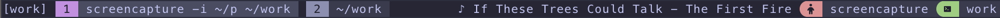

# tmux-nowplaying-macos

A tmux plugin that displays currently playing media from macOS's system-wide Now Playing widget. Works with any app that reports to the macOS media control center including web browsers, Spotify, Apple Music, and more.



## Features

- 🎵 Shows currently playing media from any macOS app
- 🌐 Works with web-based players (YouTube, SoundCloud, etc.)
- 🎧 Supports Spotify, Apple Music, and all media apps
- ⚡ Uses macOS's native MediaRemote framework
- 🎯 No external dependencies (pure Swift + bash)
- 🔧 Customizable icons and formatting
- 📜 Automatic scrolling for long artist/title text

## Requirements

- macOS 10.15 or later
- tmux 2.9 or later
- Swift runtime (included with macOS)

## Installation

### Using [TPM](https://github.com/tmux-plugins/tpm) (recommended)

Add plugin to your `~/.tmux.conf`:

```bash
set -g @plugin 'barlevalon/tmux-nowplaying-macos'
```

Press `prefix + I` to install the plugin.

### Manual Installation

Clone the repository:

```bash
git clone https://github.com/barlevalon/tmux-nowplaying-macos ~/.tmux/plugins/tmux-nowplaying-macos
```

Add this to your `~/.tmux.conf`:

```bash
run-shell ~/.tmux/plugins/tmux-nowplaying-macos/nowplaying.tmux
```

Reload tmux configuration:

```bash
tmux source ~/.tmux.conf
```

## Usage

Add `#{nowplaying}` to your `status-left` or `status-right` in `~/.tmux.conf`:

```bash
set -g status-right '#{nowplaying} | %H:%M'
```

The plugin will display the currently playing track in the format: `♪ Artist - Title`

Note: After installing the plugin, you may need to reload your tmux configuration (`prefix + r` or `tmux source ~/.tmux.conf`) for the interpolation to take effect.

## Configuration

### Customize Icons

```bash
# Playing icon (default: "♪ ")
set -g @nowplaying_playing_icon "🎵 "

# Paused icon (default: "")
set -g @nowplaying_paused_icon "⏸ "

# Stopped icon (default: "")
set -g @nowplaying_stopped_icon "⏹ "
```

### Scrolling Text

When the artist and title text is too long, it can automatically scroll:

```bash
# Maximum characters before scrolling (default: 30)
set -g @nowplaying_scrollable_threshold 30

# Format for scrollable text (default: "{artist} - {title}")
# Note: Currently always shows "Artist - Title" format
set -g @nowplaying_scrollable_format "{artist} - {title}"

# Scroll speed multiplier (default: 1)
# Higher values = faster scrolling
set -g @nowplaying_scroll_speed 1

# Padding between text repetitions (default: "   ")
set -g @nowplaying_scroll_padding "   "
```

### Auto-update

The plugin automatically updates when tmux refreshes the status bar. You can control the refresh rate:

```bash
# Refresh every 2 seconds (default: 15)
set -g status-interval 2

# Enable automatic interval adjustment for smooth scrolling (default: "yes")
# Set to "no" to disable automatic status-interval adjustment
set -g @nowplaying_auto_interval "yes"

# Interval when playing and scrolling (default: 1)
set -g @nowplaying_playing_interval 1
```

By default, the plugin automatically adjusts the refresh rate to 1 second when text is scrolling to ensure smooth animation. You can disable this by setting `@nowplaying_auto_interval` to "no".

## How It Works

This plugin uses macOS's private MediaRemote framework to access the same "Now Playing" information that appears in Control Center. Unlike other solutions that are app-specific (like AppleScript for Music.app), this works with any media source on your system.

The plugin consists of:
1. A Swift script that interfaces with MediaRemote
2. A bash wrapper that integrates with tmux
3. TPM-compatible plugin structure

## Comparison with Other Solutions

| Feature | tmux-nowplaying-macos | tmux-spotify | nowplaying-cli |
|---------|----------------------|--------------|----------------|
| Works with all media apps | ✅ | ❌ | ✅ |
| No external dependencies | ✅ | ❌ | ❌ |
| TPM compatible | ✅ | ✅ | ❌ |
| Maintained | ✅ | ❓ | ❓ |
| Cross-platform | ❌ | ❌ | ❌ |

## Troubleshooting

### Nothing is displayed

1. Ensure media is actually playing in a supported app
2. Check that the script has execute permissions:
   ```bash
   chmod +x ~/.tmux/plugins/tmux-nowplaying-macos/scripts/*
   ```
3. Test the script directly:
   ```bash
   ~/.tmux/plugins/tmux-nowplaying-macos/scripts/nowplaying.sh
   ```

### "No such file or directory" error

Make sure Swift is available:
```bash
swift --version
```

### Slow performance

The first run may be slower as Swift compiles the script. Subsequent runs will be faster.

## Contributing

Pull requests are welcome! Please feel free to submit issues or PRs.

## License

MIT - see [LICENSE](LICENSE) file for details.

## Credits

- Uses macOS MediaRemote framework
- Inspired by [tmux-spotify](https://github.com/robhurring/tmux-spotify) and [nowplaying-cli](https://github.com/kirtan-shah/nowplaying-cli)
- Created by [@barlevalon](https://github.com/barlevalon)