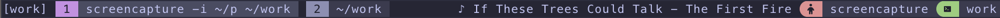

# tmux-nowplaying

Show the currently playing track in your tmux status bar.

- macOS: reads the system Now Playing state through MediaRemote.
- Linux: reads MPRIS players through `playerctl`.



## Requirements

- tmux 2.9+
- macOS 10.15+ with Swift, or Linux with `playerctl`

Install `playerctl` on Linux:

```bash
# Arch
sudo pacman -S playerctl

# Debian/Ubuntu
sudo apt install playerctl

# Fedora
sudo dnf install playerctl
```

## Install

### TPM

Add to `~/.tmux.conf`:

```tmux
set -g @plugin 'barlevalon/tmux-nowplaying'
```

Press `prefix + I`.

### Manual

```bash
git clone https://github.com/barlevalon/tmux-nowplaying ~/.tmux/plugins/tmux-nowplaying
```

Add to `~/.tmux.conf`:

```tmux
run-shell ~/.tmux/plugins/tmux-nowplaying/nowplaying.tmux
```

Reload tmux:

```bash
tmux source-file ~/.tmux.conf
```

## Use

Add `#{nowplaying}` to `status-left` or `status-right`:

```tmux
set -g status-right '#{nowplaying} | %H:%M'
```

When media is playing, output looks like:

```text
♪ Artist - Title
```

Nothing is shown when no supported player is actively playing.

## Options

```tmux
# Prefix for playing media. Default: "♪ "
set -g @nowplaying_playing_icon "🎵 "

# Enable scrolling for long text. Default: "no"
set -g @nowplaying_scrolling_enabled "yes"

# Width before scrolling/truncation. Default: 50
set -g @nowplaying_scrollable_threshold 50

# Scroll speed, 1-10. Default: 1
set -g @nowplaying_scroll_speed 1

# Gap between repeated scrolling text. Default: "   "
set -g @nowplaying_scroll_padding "   "
```

### Status refresh

tmux refreshes `#(...)` commands on `status-interval`:

```tmux
set -g status-interval 2
```

For smoother scrolling, the plugin can temporarily lower `status-interval` while long text is playing and restore the original value afterward:

```tmux
set -g @nowplaying_auto_interval "yes"
set -g @nowplaying_playing_interval 1
```

## Troubleshooting

Test the plugin directly:

```bash
~/.tmux/plugins/tmux-nowplaying/scripts/nowplaying.sh
```

Check executable permissions:

```bash
chmod +x ~/.tmux/plugins/tmux-nowplaying/nowplaying.tmux \
  ~/.tmux/plugins/tmux-nowplaying/scripts/*.sh \
  ~/.tmux/plugins/tmux-nowplaying/scripts/*.swift
```

Linux checks:

```bash
command -v playerctl
playerctl -l
playerctl metadata
```

macOS check:

```bash
swift --version
```

If scrolling settings remain after removing them from your config, unset the tmux options:

```bash
tmux set-option -gu @nowplaying_scrolling_enabled
tmux set-option -gu @nowplaying_scrollable_threshold
tmux set-option -gu @nowplaying_scroll_speed
tmux set-option -gu @nowplaying_scroll_padding
tmux set-option -gu @nowplaying_auto_interval
tmux set-option -gu @nowplaying_playing_interval
```

## License

MIT. See [LICENSE](LICENSE).
